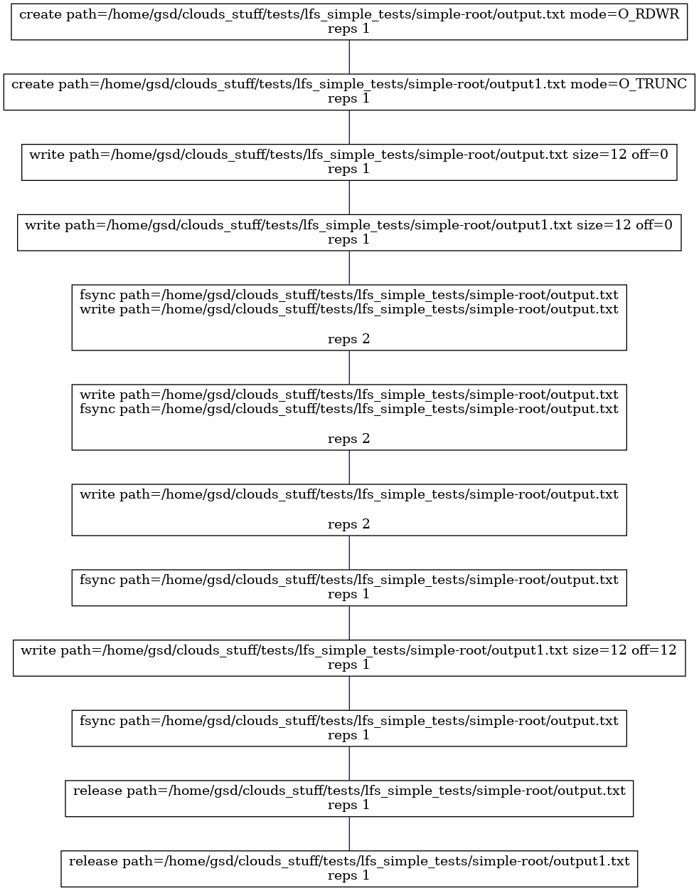

# Output parser
LazyFS produces a log file when the option `log_all_operations`is set to true and a path to a file is given in the option `logfile`. 
To simplify the visualization of the log, this parser can be used. 
It allows to:
- filter specific system calls
- filter system calls for a specific path
- create a graph from the log
- group system calls, i.e., if the same syscalls are called sequentially, the program identifies this repetition and simplifies the output
- obtain information of the location of writes bigger than a page (this value is also configurable)
  
An example of output:

  
To understand the different options run:  
`./parse.py -h`
